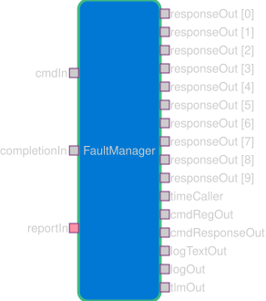
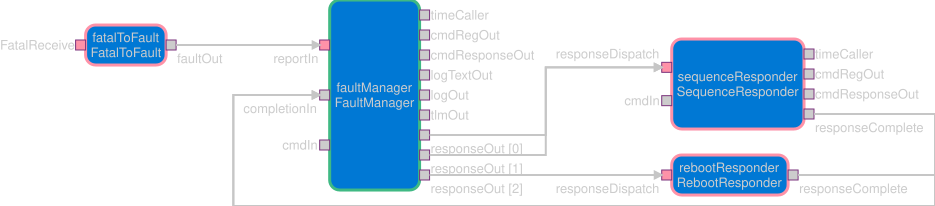

# Svc::FaultManager

Translates incoming fault report port calls into a series of fault response port calls.

## 1. Requirements

| ID                   | Description (shall)                                                                                                                                | Verification |
| -------------------- | -------------------------------------------------------------------------------------------------------------------------------------------------- | ------------ |
| SVC_FAULTMANAGER_001 | FaultManager shall have an input fault report port of a carrying a project-configured fault ID enumeration value identifying the fault to handle.  | Unit-Test    |
| SVC_FAULTMANAGER_002 | FaultManager shall maintain an ordered list of fault responses per reported fault id to execute.                                                   | Unit-Test    |
| SVC_FAULTMANAGER_003 | FaultManager accept ordered list of fault responses per reported fault at initialization.                                                          | Unit-Test    |
| SVC_FAULTMANAGER_004 | Upon receipt of a fault report, FaultManager shall sequentially walk the configured response list for the supplied fault id.                       | Unit-Test    |
| SVC_FAULTMANAGER_005 | For each response step, FaultManager shall broadcast the response to every connected response out port passing the fault and fault response IDs.   | Unit-Test    |
| SVC_FAULTMANAGER_006 | FaultManager shall accept the fault report ids and fault response ids from project-configured enumerations.                                        | Unit-Test    |
| SVC_FAULTMANAGER_007 | FaultManager shall require the project’s fault-id enumeration to define a FAULT_RESPONSE_FAILED value reserved for FaultManager response fault.    | Unit-Test    |
| SVC_FAULTMANAGER_008 | If any response step fails FaultManager shall cease fault response and emit fault report with id = FAULT_RESPONSE_FAILED.                          | Unit-Test    |
| SVC_FAULTMANAGER_009 | FaultManager shall provide a command to enable/disable fault ids.                                                                                  | Unit-Test    |
| SVC_FAULTMANAGER_011 | FaultManager shall provide a command to enable/disable specific fault response.                                                                    | Unit-Test    |
| SVC_FAULTMANAGER_014 | FaultManager shall ignore (take no action on) a reported fault id that is disabled.                                                                | Unit-Test    |
| SVC_FAULTMANAGER_015 | FaultManager shall skip any response step that is disabled and continue dispatching remaining responses.                                           | Unit-Test    |
| SVC_FAULTMANAGER_019 | FaultManager shall discard any incoming fault reports received while a fault response sequence is dispatching.                                     | Unit-Test    |
| SVC_FAULTMANAGER_020 | FaultManager shall not trigger any fault nor FATAL handling except for the specific fault FAULT_RESPONSE_FAILED.                                   | Unit-Test    |

## 2. Design



The `Svc.FaultManager` component is an `active` component. It takes fault report input port calls synchronously.  When there is no active fault response it adds the fault report to the queue to trigger a series of fault responses. When a fault response is active, incoming fault responses are discarded.

Each fault is mapped to a series of fault responses, which will be dispatched sequentially. The initial response is dispatched and the subsequent response is dispatched upon the completion of the previous response. Should a fault response return an error completion result, a FAULT_RESPONSE_FAILED fault will be reported directly and the existing fault response sequence will halt thus transitioning to handling the FAULT_RESPONSE_FAILED fault itself.

`Svc.FaultManager` uses an internal interface to queue non-discarded faults.



## 3. Configuration

`Svc.FaultManager` is project-configurable in the fault id and fault response sets, the number of fault response broadcast ports, and the fault-to-response mapping.

## 3.1 FPP Configuration

`FaultCfg.fpp` allows users to define the `FaultId`, `FaultResponse`, and `FAULT_RESPONSE_OUT_PORTS`.  `FaultId` and `FaultResponse` are enumerations of the faults and responses in the system. `FAULT_RESPONSE_OUT_PORTS` is the count of fault response broadcast ports. All three fields must be defined in `module FaultCfg`. `FAULT_RESPONSE_FAILURE` is a required value in the `FaultId` enumeration.

```
module FaultCfg {
    constant FAULT_RESPONSE_OUT_PORTS = 3

    @ Enumeration (project configured) of the potential faults in the system
    enum FaultId {
        FAULT_RESPONSE_FAILURE @< REQUIRED: fault response reported by Svc.FaultManager
    }

    @ Enumeration (project configured) of the responses Svc.FaultManager can dispatch
    enum FaultResponse {
        NO_RESPONSE = 0 @< REQUIRED: indicates no response/end of table
        SAMPLE_RESPONSE @< EXAMPLE: an example response
    }
}
```

## 3.2 C++ Initialization

`Svc::FaultManager` is initialized in C++ with a fault id to fault response list table. This allows users to configure the list of responses to emit in response to a reported fault.

```
Svc::FaultManager::ConfigurationTable config;
memset(config, 0, sizeof(config));
config[FaultCfg::FaultId::FAULT_RESPONSE_FAILURE][0] = FaultCfg::FaultResponse::SAMPLE_RESPONSE;
config[FaultCfg::FaultId::FAULT_RESPONSE_FAILURE][1] = FaultCfg::FaultResponse::NO_RESPONSE;
...
faultManager.configureResponses(config);
```