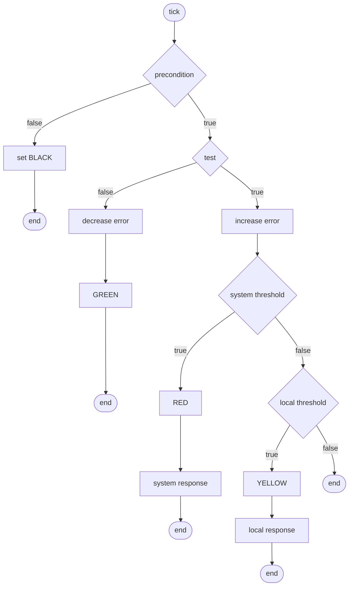

```mermaid
flowchart TD
    TICK([tick]) --> DECIDE_PRE{precondition}
    DECIDE_PRE -- false --> SET_BLACK[set BLACK] --> END1([end])
    DECIDE_PRE -- true --> PERFORM_TEST{test}
    PERFORM_TEST -- false --> REDUCE_ERR[decrease error] --> SET_GREEN[GREEN] --> END2([end])
    PERFORM_TEST -- true --> INCREMENT_ERR[increase error] --> SYS_THRESH{system threshold}
    SYS_THRESH -- true --> SET_RED[RED] --> SYS_RESP[system response] --> END3([end])
    SYS_THRESH -- false --> LOC_THRESH{local threshold}
    LOC_THRESH -- true --> SET_YELLOW[YELLOW] --> LOC_RESP[local response] --> END4([end])
    LOC_THRESH -- false --> END5([end])
```